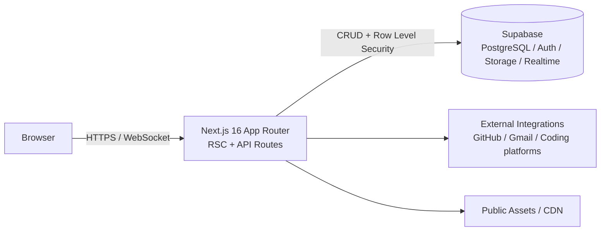
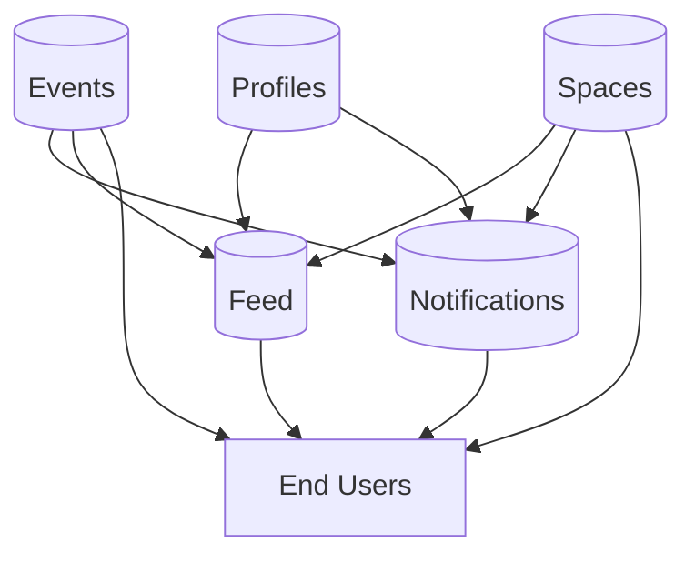

# Campus Connect 🎓

Campus Connect is a hackathon-built campus community hub crafted by the team. It unifies events, social networking, collaboration spaces, and student portfolios into one cohesive Next.js 16 + Supabase experience optimized for fast demos and real-world rollout.


## ✨ Features

### 🚀 Hackathon scope

- Built and iterated rapidly for a campus hackathon demo
- Prioritized fast onboarding, visible engagement loops, and end-to-end event flows

### 🏠 **Home Dashboard**

- **Spotify-inspired** hero section with gradient overlays and glassmorphism
- **Featured Events** in grid card layout with hover animations
- **Announcements** from admins displayed in clean notification style
- **Trending Feed** showing popular campus posts
- Real-time updates and dynamic content

### 👤 **Student Profiles (Anti-Gravity Theme)**

- **Portfolio-style profiles** with custom banners and avatars
- **Gamified leveling system** with XP earned from coding platforms, events, and contributions
- **Coding integrations**: GitHub, LeetCode, Codeforces, HackerRank, CodeChef
- **GitHub contribution graph** with hover effects and activity stats
- **Skills, Projects, Experience & Education** sections
- **Tab navigation** (Overview, Projects, About)
- **Public/Private** profile visibility settings
- **Responsive** 2-column layout (main content + sidebar)

### 📅 **Events & Team Management**

- **Event creation & management** by admins
- **Registration system** with team support (solo, team, or both)
- **Team formation** with leader roles and member invitations
- **Event details page** with rich descriptions and form fields
- **Comment sections** for event discussions
- **Participant tracking** and attendance management

### 🗣 **Social Feed**

- **Microblogging platform** for campus-wide posts
- **Rich text posts** with image attachments
- **Like & Comment** system with real-time counters
- **Mentions & hashtags** support
- **Trending algorithm** based on engagement
- **Optimistic updates** for instant feedback

### 💬 **Spaces (Clubs & Groups)**

- **Public and private** collaboration spaces
- **Real-time chat** with message history
- **Invite system** for private spaces
- **Member management** with role-based permissions
- **Space discovery** page with search and filtering

### 📧 **Alerts (Email Integration)**

- **Gmail sync** with OAuth integration
- **Email parsing** with safe HTML rendering
- **Starred emails** highlighted for important messages
- **Read/Unread** status tracking
- **Search & filter** functionality
- **Responsive** email viewer with threading support

### 🔧 **Admin Dashboard**

- **Event management** (create, edit, delete)
- **User role management** (admin designation)
- **Content moderation** tools

## 🎨 Design System

- **Theme**: Dark Mode (Spotify Black `#121212` + Premium Purple `#a970ff`)
- **Components**: Radix UI + custom components with Framer Motion animations
- **Typography**: Clean, modern Inter/system fonts
- **Spacing**: 8px grid system for consistent layouts
- **Cards**: Glassmorphism with subtle borders and shadows
- **Hover effects**: Scale, glow, and color transitions
- **Responsive**: Mobile-first with adaptive layouts

## 🛠 Tech Stack

### Frontend

- **Framework**: [Next.js 16](https://nextjs.org) (App Router + Turbopack)
- **Language**: TypeScript
- **Styling**: Tailwind CSS + Custom CSS
- **UI Components**: Radix UI, Shadcn/ui patterns
- **Animations**: Framer Motion
- **State**: React Server Components + Client Components

### Backend

- **Database**: [Supabase](https://supabase.com) (PostgreSQL)
- **Auth**: Supabase Auth (Google OAuth, Email/Password)
- **Storage**: Supabase Storage (Avatars, Event Banners, Attachments)
- **Real-time**: Supabase Realtime subscriptions
- **API**: Next.js API Routes + Server Actions

### Integrations

- **GitHub**: GraphQL API for contributions and stats
- **LeetCode**: Web scraping for problem counts
- **Codeforces**: REST API for ratings and ranks
- **HackerRank**: Web scraping for badges
- **CodeChef**: REST API for ratings
- **Gmail**: OAuth + Google APIs for email sync

## 🏗️ Architecture

Campus Connect uses a thin Next.js layer that fans out to Supabase for data, auth, storage, and realtime updates, plus a small set of external enrichments.



Key flows:

- **Auth**: Supabase Auth (Google OAuth + email/password) with sessions exposed to React Server Components and enforced via middleware.
- **Events / Spaces / Feed**: Server Actions and API Routes read/write Supabase tables; realtime subscriptions push updates to active clients.
- **Integrations**: Server-side fetchers call GitHub, Gmail, and coding-site APIs to enrich profiles and alerts; responses are cached in Supabase.

Feature interaction map:



## 📂 Project Structure

```
campus-connect/
├── app/                      # Next.js App Router
│   ├── actions/             # Server Actions
│   ├── admin/               # Admin Dashboard
│   ├── alerts/              # Email Alerts
│   ├── api/                 # API Routes
│   ├── events/              # Events Hub
│   ├── feed/                # Social Feed
│   ├── login/               # Auth Pages
│   ├── profile/             # User Profiles
│   ├── spaces/              # Collaboration Spaces
│   ├── layout.tsx           # Root Layout
│   └── page.tsx             # Home Dashboard
├── components/              # React Components
│   ├── events/             # Event Components
│   ├── feed/               # Feed Components
│   ├── profile/            # Profile Components
│   ├── spaces/             # Space Components
│   ├── ui/                 # Reusable UI Components
│   ├── AuthProvider.tsx    # Auth Context
│   ├── Sidebar.tsx         # Desktop Navigation
│   └── BottomNav.tsx       # Mobile Navigation
├── lib/                     # Utilities & Logic
│   ├── profile/            # Profile Logic (XP, Integrations)
│   ├── supabase/           # Supabase Clients
│   ├── email/              # Email Parsing
│   └── utils.ts            # Helpers
├── supabase/
│   ├── migrations/         # Database Migrations
│   └── schema.sql          # Database Schema
├── types/                   # TypeScript Definitions
├── middleware.ts            # Auth & Routing Middleware
├── next.config.ts           # Next.js Config
├── tailwind.config.ts       # Tailwind Config
└── package.json             # Dependencies
```

## 🗄 Database Schema

### Core Tables

- `users` - User accounts
- `profiles` - Extended user profiles
- `events` - Campus events
- `event_registrations` - Event participant tracking
- `teams` - Team formations for events
- `spaces` - Collaboration groups
- `space_members` - Space membership
- `messages` - Space chat messages
- `posts` - Social feed posts
- `comments` - Post comments
- `likes` - Post likes
- `notifications` - User notifications
- `coding_stats_unified` - Coding platform stats
- `profile_integrations` - External integrations
- `profile_skills`, `profile_projects`, `profile_experience`, `profile_education` - Portfolio data

## 🔐 Authentication

- **OAuth Providers**: Google
- **Email/Password**: Supported
- **Session Management**: Supabase Auth with HTTP-only cookies
- **Domain Validation**: `@vedamsot.org` email restriction
- **Role-Based Access**: Admin role for privileged actions
- **Middleware Protection**: Automatic route protection

## 📝 License

MIT License - see LICENSE file for details

## Acknowledgments

- Design inspiration: Spotify, GitHub, Linear
- UI Components: Radix UI, Shadcn
- Database: Supabase
- Framework: Next.js

---

Built with ❤️ by Team V5
